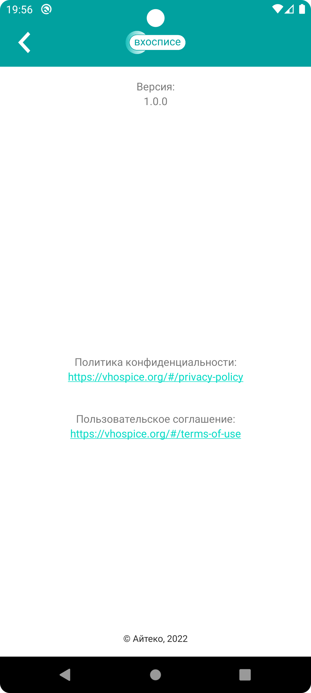

# План тестирования мобильного приложения "Мобильный хоспис"

**Объект тестирования:** мобильное приложение "Мобильный хоспис".

Приложение на базе Android, позволяет работать с претензиями хосписа и включает в себя:
   - информацию о претензиях и функционал для работы с ними;
   - новостную сводку хосписа;
   - тематические цитаты.

**Цели тестирования:**
1. Составить чек-лист для проверки приложения
2. Составить тест-кейсы для проверки приложения
3. Провести ручное тестирование 
4. Автоматизировать проверку тест-кейсов по чек-листу
5. Составить отчёты о тестировании

## Тестовые данные
Логин(Login): login2
Пароль(Password): password2

## Тестовые границы
1. Страница "Авторизация"
   - Поле ввода для логина(Логин)
   - Поле ввода для пароля(Пароль)
   - Кнока "Войти" для авторизации
   - Авторизация в приложении

    

2. Страница "Главная"
   - Навигационное меню(иконка "бургер"/три горизонтальные черты)
   - Просмотр текущих новостей
   - Вкладка "Все новости"("Все новости")
   - Страница с цитатами "Главное-жить любя"(иконка "бабочка")
   - Выход из приложения(иконка "фигура человека")

    
    страница "Главная"

    
    навигационное меню

3. Страница "Новости"
   - Просмотр новостей
   - Разворачивание/сворачивание новостей
   - Сортировка по возрастанию/убыванию
   - Фильтрация новостей
   - Раздел "Панель управления"(сортировка, фильтрация, создание, редактирование, удаление новостей)
   
     
    страница "Новости"

    
    раздел "Панель управления"

4. Страница "О приложении"
   - ссылка "Политика о конфиденциальности"
   - ссылка "Условия использования"

    
    страница "О приложении"

## Виды тестирования
**Для полей ввода**
1. Позитивное тестирование 
   - использование предоставленных данных для авторизации в приложении
2. Негативное тестирование 
   - использование отличных данных от предоставленных для авторизации, с применением техник граничных и эквивалентных значений

**Для приложения**
1. Функциональное тестирование. 
   - Ручное 
   - Автоматизированнное
2. UI- и UX-тестирования. Проводится для проверки понимания интерфейса и удобства его использования пользователями.

В виду отсутствия конкретных требований к приложению будет проводено исследовательское тестирование для понимания работы приложения и функционала с точки зрения здравого смысла

## Документация
1. Чек-лист(Check)
2. Тест-кейсы(Case)

## Перечень используемых инструментов
1. Android studio - это интегрированная среда разработки для операционной системы Android. Встроенный эмулятор Android позволяет создавать и управлять виртуальными устройствами, 
что упрощает проведение функциональных тестов на различных Android конфигурациях.
2. Git - это система контроля версий, которая позволяет хранить, отслеживать все изменения в проекте и одновременно работать над одним проектом всей команде.
3. JDK 11 - представляет из себя реализацию спецификации платформы Java, включает в себя компилятор и библиотеки классов.
4. Gradle - система для автоматизации сборки проекта и управления зависимостями, применяющая языки Java и Kotlin, и др.
5. Allure - это инструмент для построения понятных отчётов автотестов. 
6. Ecspresso - фреймворк для написания автоматизированных тестов пользовательского интерфейса приложений на Android.

## Перечень рисков при автоматизации
1. Нет технической документации по проекту, что увеличивает время на написание автотестов.
2. Нехватка знаний и навыков в области автоматизации тестирования может привести к ошибкам в процессе разработки и выполнения 
3. Неправильный выбор инструментов автоматизации тестирования, что может привести к увеличению времени тестирования и затруднению в разработке тестов. 
4. Недостаточное покрытие тестами. Некоторые сценарии тестирования могут быть пропущены или недостаточно покрыты из-за ограниченных ресурсов или времени. 
5. Проблема поддержки. После создания тестовых скриптов и их запуска необходимо следить за их исправностью и обновлять при изменениях в приложении. 
6. Недостаточная организация или планирование процесса могут привести к затягиванию сроков, нехватке ресурсов и недостаточной коммуникации между участниками проекта. 
7. Написание автотестов требует высоких денежных затрат и времени
8. Автотесты могут утратить свою актуальность, поэтому необходимы дополнительные затраты на поддержание их актуальности  и доработку.

## Необходимые специалисты
Один специалист по ручному и автоматизироуванному тестированию

## Интервальная оценка с учетом рисков
1. Проведение исследовательского тестирования - до 48 часов
2. Написание тест-плана, чек-листа и тест-кейсов до 48 часов 
3. Написание автотестов и прогон до 8 часов в день 
4. Время на непредвиденные ситуации до 72 часов 
5. Общие временные затраты до 28 дней

## Сроки сдачи проекта тестирования
1. План тестирования, чек-лист, тест-кейсы до 31.03.24 
2. Настройка окружения, написание, и отладка автотестов до 07.04.2024
3. Отчет по автоматизированному тестированию 14.04.24
4. Отчет по итогам тестирования до 21.04.24

